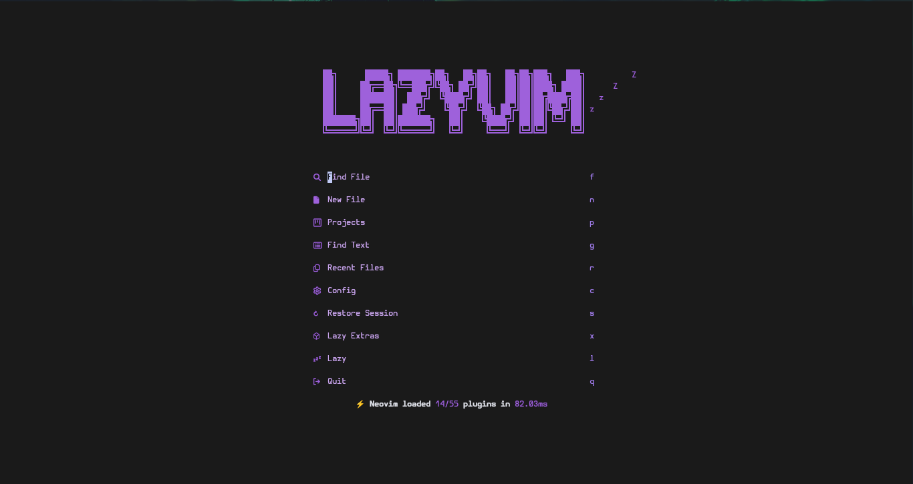
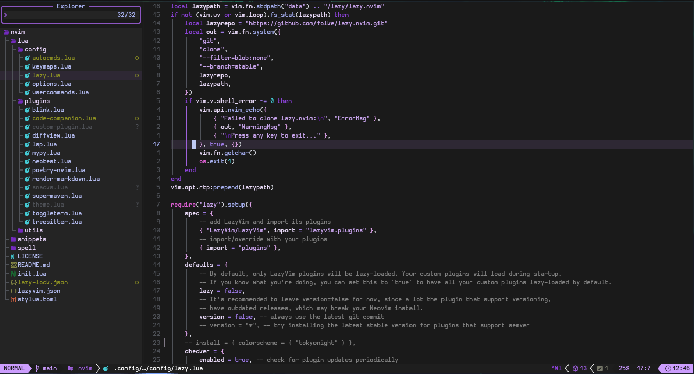
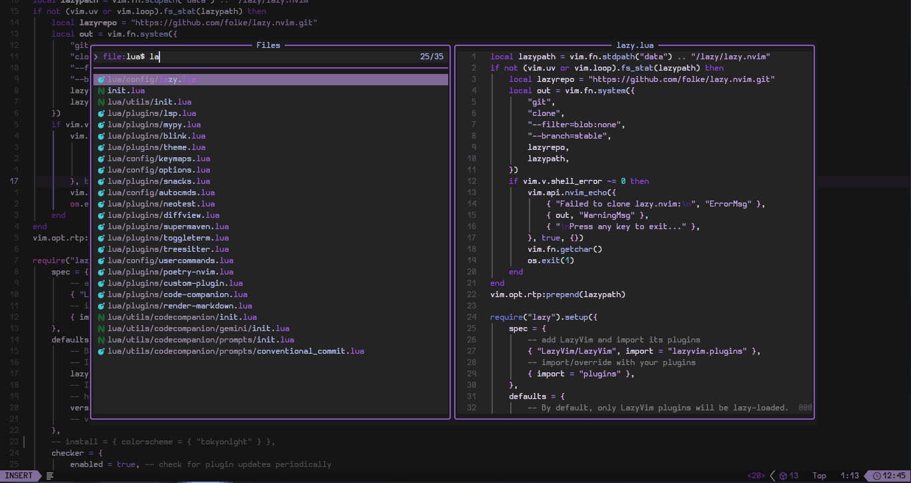
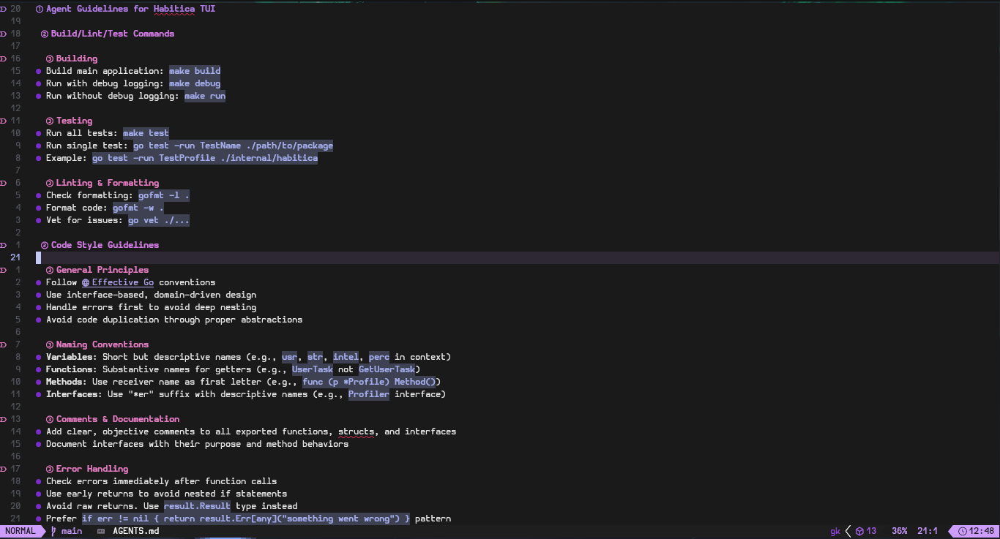

# Roxane

A dark Neovim colorscheme with lush purple accents, built using [lush.nvim](https://github.com/rktjmp/lush.nvim).

## Features

- Comprehensive syntax highlighting for various languages
- Support for popular Neovim plugins (Telescope, Noice, Blink-cmp, etc.)
- Tree-sitter and LSP semantic token highlighting
- Dark theme optimized for long coding sessions

## Screenshots


*Dashboard example*


*General editor view*


*Picker interface*


*Markdown rendering*

## Requirements

- Neovim 0.8+
- [lush.nvim](https://github.com/rktjmp/lush.nvim)

## Installation

### Using [LazyVim]()

```lua
return {
    {
        "LeandroDeJesus-S/roxane.nvim",
        lazy = false,
        priority = 1000,
        config = function()
            vim.cmd("colorscheme roxane")
        end,
    },
}
```

### Using [packer.nvim](https://github.com/wbthomason/packer.nvim)

```lua
use 'LeandroDeJesus-S/roxane.nvim'
```

### Using [vim-plug](https://github.com/junegunn/vim-plug)

```vim
Plug 'LeandroDeJesus-S/roxane.nvim'
```

## Usage

Add the following to your Neovim configuration:

```lua
vim.cmd('colorscheme roxane')
```

## Building

The colorscheme uses [Shipwright](https://github.com/rktjmp/shipwright.nvim) to compile the theme. Run the build script:

```bash
:Shipwright
```

This generates the compiled colors in `colors/roxane.lua`. Note: The build script may not include all custom highlight groups. If certain plugin highlights (e.g., SnacksDashboard) are missing, add them manually to `colors/roxane.lua` outside `-- PATCH_OPEN` and `-- PATCH_CLOSE`.

I recommend you read [Extending a lush colorscheme](https://github.com/rktjmp/lush.nvim/blob/main/EXTEND.md) if you want to make changes.

## License

See [LICENSE](LICENSE) for details.
